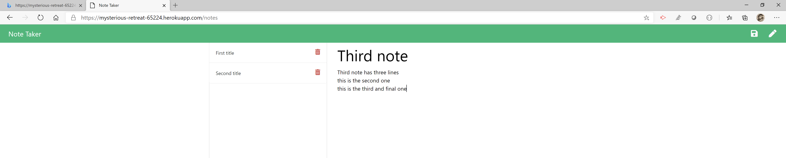

# Welcome to Your Personal Note Taker!

Create and save unlimited personal or work notes! Delete notes you don't want anymore! Say goodbye to embarrasing 'senior moments' forever!

The purpose of this project was to build an application that can write, save, and delete notes using an express backend to save and retrieve note data from a JSON file. The project user story is below.

```
AS A user, I want to be able to write and save notes

I WANT to be able to delete notes I've written before

SO THAT I can organize my thoughts and keep track of tasks I need to complete
```

The criteria for a successful project are below:

- Application should allow users to create and save notes.

- Application should allow users to view previously saved notes.

- Application should allow users to delete previously saved notes.

## Getting Started



Below is a print screen from the application, the link to the project repository and a link to the deployed application on Heroku.

https://github.com/markshelgren/noteTaker

https://mysterious-retreat-65224.herokuapp.com/

### Development

Below are the steps I took to create the application as it is so far. The most difficult aspect of this application for me was using a constructor to cover all aspects of the notes (writing, reading, saving, deleting).

1. Created and linked the initial files (JS files, HTML files, JSON files).

2. Downloaded all dependencies using npm.

3. Created all routes and verified them with small tests using Postman.

4. Verify the functionality of the application, then deploy to Heroku.

## Testing

This application was not developed using Test Driven Development. However, at numerous points throughout development, console.log's were used to test the results of new elements.

## Deployment

This program can be viewed and deployed using most internet browsers via the links in the "Getting Started" section.

## Built With

- [VSCode](https://code.visualstudio.com/) - The platform I used for developing this project.
- [GoogleChrome](https://www.google.com/chrome/) - Used for inspector tool and validating the program during development.
- [NodePackageManager](https://www.npmjs.com/) - Used to install node modules/dependencies
- [Postman](https://www.getpostman.com/) - A collaboration platform for API development.

## Authors

- **Mark Shelgren** - [markshelgren](https://github.com/markshelgren)

## Acknowledgments

- The advisors, instructors, and TAs at the Coding Bootcamp at the University of California, Irvine
- Fellow classmates at the Coding Bootcamp at UC Irvine
- Friends in the industry
